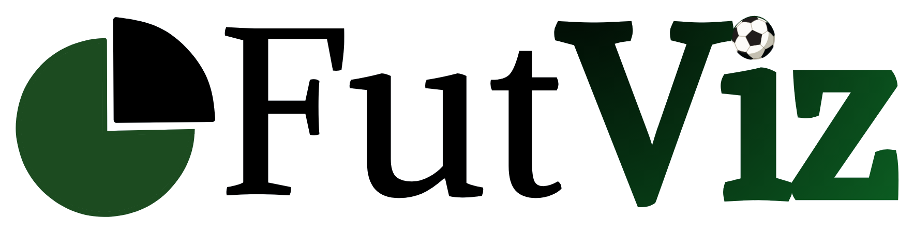

<p align="center">
  
</p>

<p align="center">
  Nació de juntar mi pasión por el <strong>fútbol</strong> con la <strong>ciencia de datos</strong>:
  partir de información pública y simple, y sacarle todo el jugo posible.
</p>

<p align="center">
  <a href="https://futviz-lake.vercel.app"><strong>Ver el sitio →</strong></a>
</p>

---

## Qué es

**FutViz** es un proyecto de ciencia de datos deportiva sobre las 5 grandes ligas europeas
de fútbol, temporada 2025/2026.
Arranca con un EDA (análisis exploratorio) a nivel de **equipo** y de **jugador**, con la idea
de ir subiendo en complejidad más adelante: desde exploración general hasta análisis más
específicos y la inclusión de **Machine Learning**.

Los datos son públicos y gratuitos ([fbref](https://fbref.com) para equipos, 
[Understat](https://understat.com) para jugadores), así que no traen estadísticas súper 
avanzadas, pero sí lo suficiente para sacar insights reales con buen tratamiento visual.


## Estructura del repo

```
data/           CSVs públicos de fbref (equipos) y Understat (jugadores)
code/           Notebooks del EDA (laboratorio) + viz_theme.py (identidad visual compartida)
web/
  charts/       Los mismos gráficos de los notebooks, portados a funciones que arman HTML
  build.py      Genera el sitio estático completo en web/dist/
  site_utils.py Plantillas de página (landing, secciones, gráficos individuales)
  dist/         Sitio generado — se commitea tal cual para el deploy
img/            Logo y assets de marca fuente (no versionado — se procesa en cada build)
```

## Cómo correrlo

**Notebooks** (laboratorio de cada gráfico):

```bash
pip install pandas matplotlib plotly numpy pillow
jupyter notebook code/eda_teams.ipynb    # o code/eda_players.ipynb
```

**Sitio estático** (regenera `web/dist/` a partir de `web/charts/`):

```bash
cd web
python build.py
```